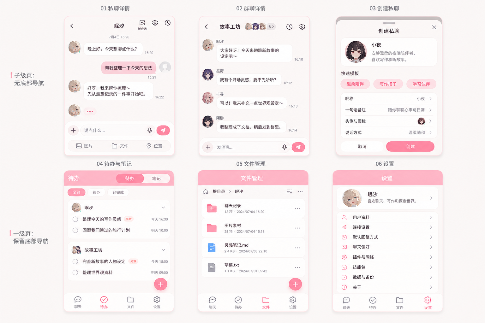

# NyxAgent 其他页面 UI 设计稿 v2

生成日期：2026-07-06

## 这版修正

- 子级页面不放底部导航：私聊详情、群聊详情、创建私聊只保留返回型顶部栏。
- 一级页面保留底部导航：待办/笔记、文件管理、设置继续使用「聊天 / 待办 / 文件 / 设置」。
- 功能重新对齐现有项目：私聊、群聊、创建私聊弹窗、待办/笔记、文件管理、设置菜单。
- 视觉继续沿用当前首页方向：淡雅粉色、成熟可爱、普通聊天 App 氛围，避免过多 AI / 工具 / 调度感。

## 设计稿

## 落地备注

- 子级页落地时不应挂 `TabBar`，只使用带 `showBack` 的 `NavBar`。
- 一级页可继续使用现有 `TabBar`：`pages/todo/todo`、`pages/files/files`、`pages/settings/settings`。
- 图中「连接设置 / 默认回复方式 / 聊天偏好」是对现有技术设置的用户侧包装命名，底层功能仍按现有 UTS 数据结构实现。
