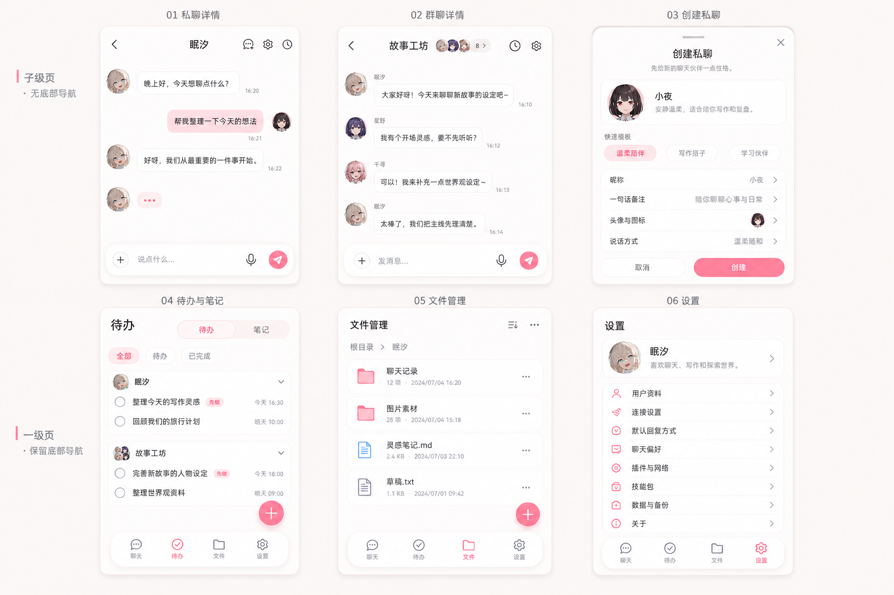

# NyxAgent 其他页面 UI 设计稿 v3

生成日期：2026-07-06

## 本版方向

上一版的问题是太像模板 App：大面积粉色栏、层级偏重、质感变土。v3 改为更贴近当前首页的淡雅方向：

- 大面积背景使用暖白 / 奶白，粉色只做点缀。
- 子级页继续坚持无底部导航：私聊详情、群聊详情、创建私聊。
- 一级页保留底部导航：待办/笔记、文件管理、设置。
- 顶部不使用整条粉色导航栏，改为文字标题 + 轻卡片。
- 仍按现有功能组织页面，不额外塞工具执行、调度、模型面板等内容。

## 设计稿

## 落地备注

- 子级页：`pages/chat/chat`、`pages/group-chat/group-chat`、创建私聊弹窗，不挂 `TabBar`。
- 一级页：`pages/todo/todo`、`pages/files/files`、`pages/settings/settings`，使用轻量浮动底栏。
- 视觉落地时优先还原：暖白背景、白色卡片、细边框、轻阴影、低饱和粉色按钮。
