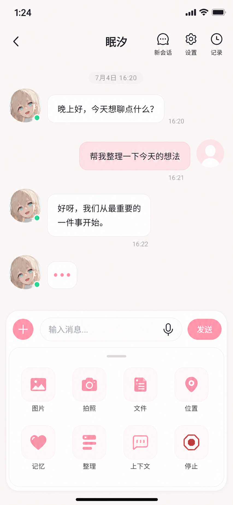
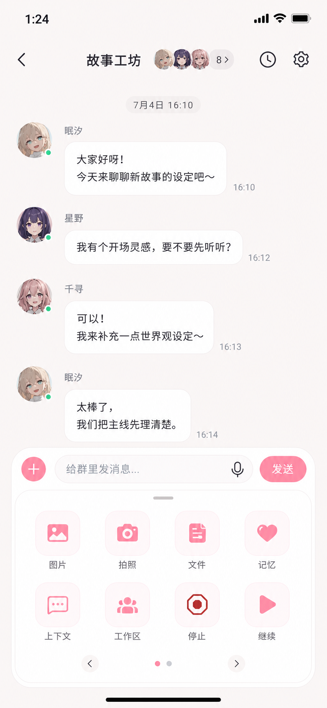
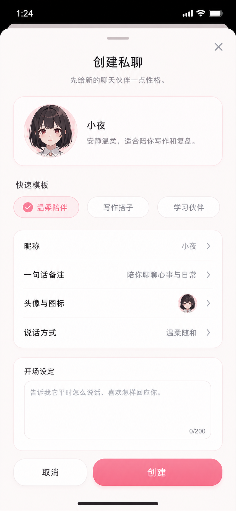
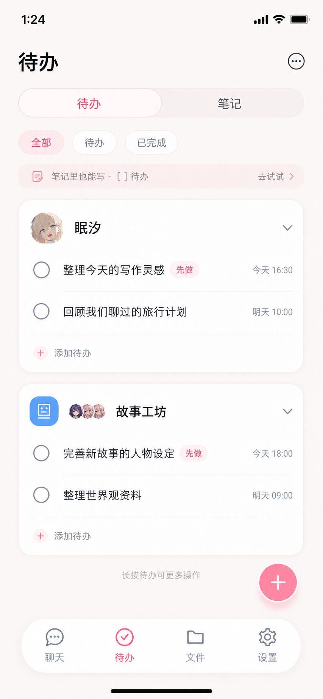
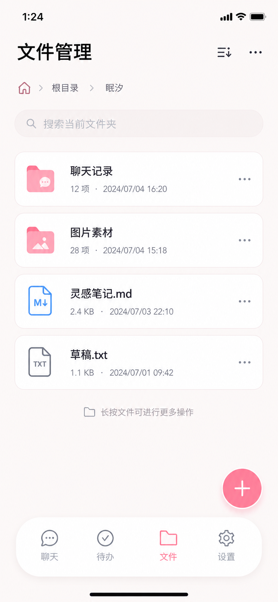
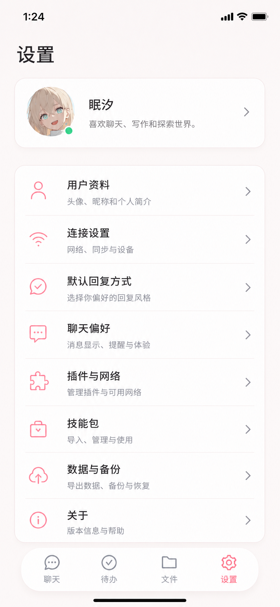

# NyxAgent 页面级 UI 设计稿 v5

日期：2026-07-06

## 本轮修正

- 每个界面单独出图，不再把多个页面挤在一张设计图里。
- 聊天类子级页面不放底部导航，避免和页面层级冲突。
- 私聊、群聊页面补齐输入区与工具栏展开态，方便直接落地交互。
- 风格延续当前首页方向：淡雅粉色系、可爱但不过度低龄化，减少“AI 工具后台感”，保留普通聊天 App 的亲和感。
- 工具栏按现有功能做用户侧轻量命名，实际文案以实现为准。

## 页面清单

### 私聊详情 · 工具栏展开

- 文件：`./nyxagent-page-private-chat-tools-v5-20260706.png`
- 覆盖：顶部返回/会话操作、消息流、输入框、语音入口、发送按钮、工具栏展开网格。
- 工具栏参考：图片、拍照、文件、位置、记忆、整理、上下文、停止。

### 群聊详情 · 工具栏展开

- 文件：`./nyxagent-page-group-chat-tools-v5-20260706.png`
- 覆盖：群聊标题与成员头像、消息流、输入框、工具栏展开网格、分页提示。
- 工具栏参考：图片、拍照、文件、记忆、上下文、工作区、停止、继续；第二页承载会话分支、群聊设置、调度记录等低频项。

### 创建私聊

- 文件：`./nyxagent-page-create-private-v5-20260706.png`
- 覆盖：选择智能体、快速标签、昵称、记忆方式、开场设置、取消/创建按钮。

### 待办 / 笔记

- 文件：`./nyxagent-page-todo-notes-v5-20260706.png`
- 覆盖：一级页底部导航、待办/笔记切换、个人待办、群组待办、完成状态、悬浮新增按钮。

### 文件管理

- 文件：`./nyxagent-page-files-v5-20260706.png`
- 覆盖：一级页底部导航、分类入口、搜索、文件列表、更多操作、上传/新增按钮。

### 设置

- 文件：`./nyxagent-page-settings-v5-20260706.png`
- 覆盖：一级页底部导航、账号卡片、用户资料、连接设置、默认回复方式、聊天偏好、插件与网络、数据与备份、关于。

## 落地备注

- 子级页面：私聊详情、群聊详情、创建私聊，不出现底部导航。
- 一级页面：待办、文件、设置，保留当前首页同源的轻量底部导航。
- 工具栏视觉保持“聊天附加面板”而不是“AI 控制台”，只露出用户能理解的短标签。
- 图中文字为设计表达，最终实现可以继续沿用现有业务字段与跳转逻辑。
