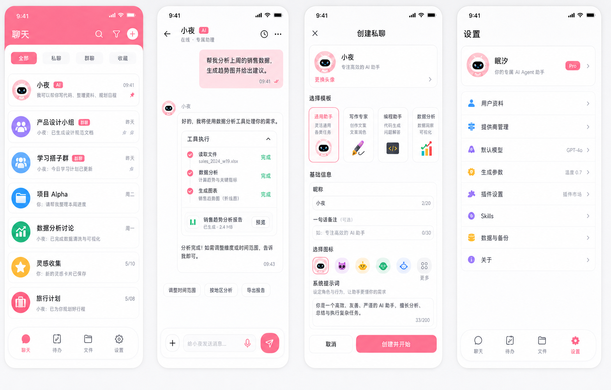

# NyxAgent UI 设计稿 v3（贴近现状精修版）

## 设计定位

- 不换调性：继续走当前项目的粉白、轻量、圆角卡片路线。
- 不做概念海报：这版按真实 App 截图感生成，避免大品牌头图、霓虹、暗黑、玻璃拟态。
- 不重构信息架构：保留现有聊天列表、聊天页、创建私聊、设置页的主要结构，只优化密度、层级和统一性。

## 可直接参考的改动点

1. **聊天列表**
   - 粉色 `NavBar` 保留，但按钮更轻、更圆。
   - 会话项改成独立圆角卡片，比纯分割线列表更柔和。
   - AI / 群聊 badge 保持小尺寸，避免抢主标题。

2. **聊天页**
   - 用户气泡保持淡粉渐变或淡粉底。
   - AI 气泡白底 + 浅边框，适合长文本。
   - `工具执行` 用嵌套卡片表达步骤完成态，和当前 ReAct 能力贴合。
   - 底部输入栏不炫技，保留 `+`、输入框、语音、发送。

3. **创建私聊**
   - 与当前创建弹窗的数据结构基本一致：预览卡、模板、基础信息、图标、系统提示词、底部操作。
   - 可以优先把现有全屏弹窗改得更规整，而不是新增复杂交互。

4. **设置页**
   - 保留分组菜单，不做仪表盘化。
   - 右侧增加简短状态值，例如默认模型、插件市场、温度等。
   - 图标用柔和辅助色，维持轻量感。

## 设计令牌

| Token | Value |
| --- | --- |
| `--rice-primary-color` | `#FB8FAB` |
| `--rice-primary-color-1` | `#FDE8EF` |
| `--rice-background` | `#F5F5F7` |
| `--rice-background-2` | `#FFFFFF` |
| `--rice-text-color` | `#111827` |
| `--rice-text-color-2` | `#6B7280` |
| `--rice-text-color-3` | `#9CA3AF` |
| `--rice-border-color` | `#F0F0F2` |

## 落地优先级

1. 先统一 `NavBar` / `TabBar` 视觉。
2. 再改 `pages/agents/agents.uvue` 会话列表和创建私聊弹窗。
3. 然后改 `pages/chat/chat.uvue` 输入栏与工具执行块。
4. 最后统一 `pages/settings/settings.uvue` 菜单卡片。

## 注意

AI 生成图里的细小文案只作为视觉参考，实现时以项目现有 UTS 类型、页面数据和中文文案为准。
